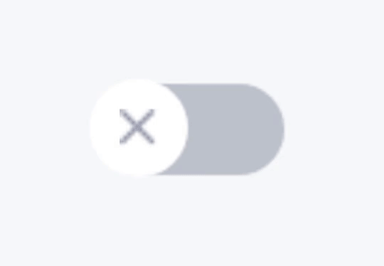

# react-native-switch-with-icons

A simple switch component with icons in the thumb.


<a href="https://www.npmjs.com/package/react-native-switch-with-icons" target="_blank"></a>


## Example



## Installation

```bash
npm i react-native-switch-with-icons
```

or

```bash
yarn add react-native-switch-with-icons
```

## Usage

```js
import SwitchWithIcons from "react-native-switch-with-icons";

const [darkMode, setDarkMode] = useState(false);

<SwitchWithIcons
  value={darkMode}
  onValueChange={setDarkMode}
/>
```

## Properties

| Prop               | Description                          | Type     | Default                                                   |
| :----------------- | :----------------------------------- | :------- | :-------------------------------------------------------- |
| value              | The value to be represented          | Boolean  | false                                                     |
| disabled           | Defines if user can interact         | Boolean  | false                                                     |
| noIcon             | Sets the visibility of the icon      | Boolean  | false                                                     |
| onValueChange      | Change value callback                | Function | -                                                         |
| icon               | The icons to be displayed            | Object   | {true: SwitchOn, false: SwitchOff}                        |
| trackColor         | The colors of the track              | Object   | {true: "rgb(144, 195, 240)", false: "rgb(187, 194, 204)"} |
| thumbColor         | The colors of the thumb              | Object   | {true: "rgb(52, 149, 235)", false: "rgb(255, 255, 255)"}  |
| iconColor          | The colors of the icons              | Object   | {true: "#FFFFFF", false: "#9499AD"}                       |
| disabledThumbColor | The color of the thumb when disabled | String   | "#9499AD"                                                 |
| disabledTrackColor | The color of the track when disabled | String   | "#BCBFC9"                                                 |
| disabledIconColor  | The color of the icon when disabled  | String   | "#FFFFFF"                                                 |
| animationDuration  | The duration of the animation        | Number   | 200                                                       |

## Contributing

Pull requests are welcome.
